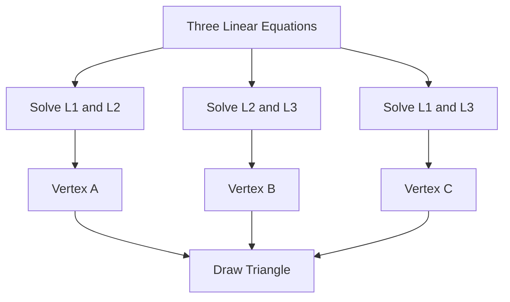
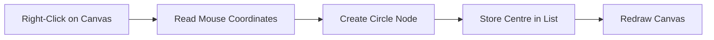
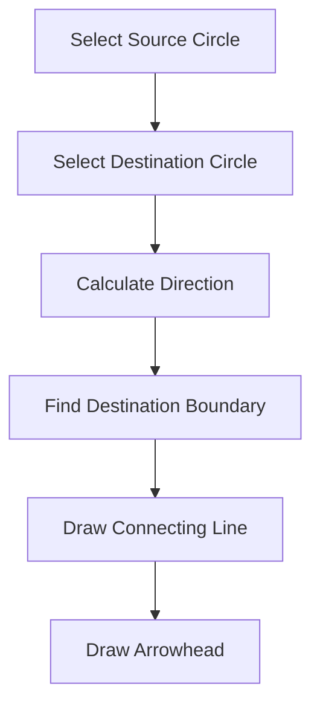
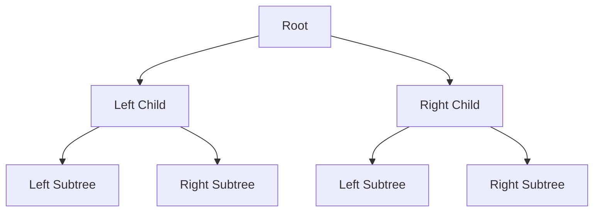
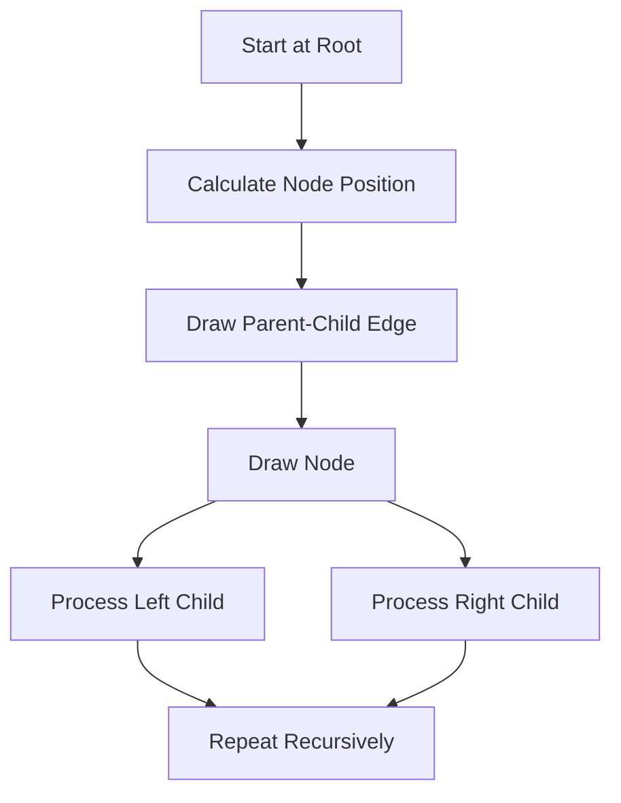
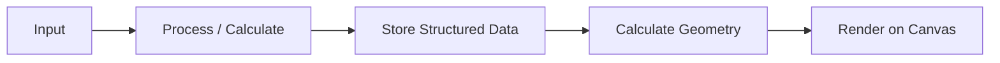

# Class Session: 01/09/26

## Notes

### 1. Drawing a Triangle from Three Linear Equations

The first exercise was to create a JavaFX program where the user enters three linear equations. Each equation represents one side of a triangle. The program reads the equations, finds the intersections between the lines and uses those intersection points as the three vertices of the triangle.

For two equations written in the form:

```text
y = m₁x + c₁
y = m₂x + c₂
```

their intersection can be found by equating the two right-hand sides:

```text
m₁x + c₁ = m₂x + c₂
```

Therefore:

```text
x = (c₂ - c₁) / (m₁ - m₂)
```

After finding `x`, it can be substituted into either equation to obtain `y`. Repeating this for each pair of the three equations gives the three vertices of the triangle.

The overall process is:



The equations must produce three valid intersection points. If two lines are parallel, they do not provide a normal intersection point and the triangle cannot be formed from that pair.

### 2. Drawing Circles on a JavaFX Canvas

The second exercise involved drawing circles on a JavaFX `Canvas`.

A mouse event can be used to detect a right-click on the canvas. The event provides the mouse coordinates, which can then be used as the centre of a new circle.

The circle can be displayed using methods such as:

```java
gc.fillOval(x - r, y - r, 2 * r, 2 * r);
```

The centre points of the circles need to be stored instead of drawing each circle only once. Storing them makes it possible to redraw the complete canvas whenever necessary.

A collection such as an `ArrayList` can be used to keep the stored circle nodes.



This also allows the application to remember previous circles and use them later for interaction.

### 3. Connecting Circles with Arrows

The circles can also be connected with directed arrows.

The user selects a source circle and a destination circle. A line is then drawn between their centres, but the line should normally stop at the boundary of the destination circle instead of continuing into its centre.

The direction of the arrow is determined by the vector between the two circle centres.

The general process is:



If the source centre is `(x₁, y₁)` and the destination centre is `(x₂, y₂)`, the direction of the connection depends on:

```text
Δx = x₂ - x₁
Δy = y₂ - y₁
```

The line can then be shortened so that it meets the circumference of the destination circle rather than its centre.

This exercise connected mouse interaction with coordinate storage, vector calculations and graphical rendering.

### 4. Binary Tree Representation

The third exercise was to represent a binary tree graphically.

A binary tree is a hierarchical data structure in which each node can have at most two children: a left child and a right child.

A node can contain a value and references to its child nodes. Instead of storing the screen position directly as permanent data, the position of each node can be calculated from its position in the tree.

A simple structure is:



The root is placed near the top of the canvas. The left and right children are positioned below it with suitable horizontal spacing.

### 5. Recursive Tree Layout

The binary-tree drawing process can use recursion because a subtree is itself another binary tree.

The program can divide the available horizontal region between the left and right children and then recursively calculate the positions of the remaining nodes.

Before drawing a node, the program can first draw the edge from its parent to that node. It can then draw the node itself and display its value.

A more general layout process is:



This shows how a data structure can be converted into a visual representation without hard-coding the position of every node.

### 6. Connecting User Input, Data and Rendering

The three exercises followed a similar pattern even though they used different inputs.

In the triangle program, text equations are converted into mathematical intersections. In the circle program, mouse events are converted into stored coordinates and graphical objects. In the binary-tree program, the stored node relationships are converted into positions and edges on the canvas.

The common idea is:



This separation makes the programs easier to understand because input, calculation, data storage and rendering each have their own role.

## Questions

1. How are the three triangle vertices obtained from the three equations?

2. Why do we store the circle centres instead of only drawing the circles once?

3. How can recursion be used to calculate the layout of a binary tree?

## Reflection

Today's class showed me that graphics programming is not only about drawing something on the screen. In the triangle exercise, the program first had to understand the equations and calculate their intersection points before it could draw the triangle.

The circle and arrow exercise made the role of user interaction clearer to me. A mouse click gives us coordinates, but the program has to store those coordinates and use them again when the canvas is redrawn or when two circles are connected.

The binary tree exercise was also interesting because the structure of the data itself affects how it is displayed. Using recursion to position the nodes showed me that a graphical layout can be generated from the relationships already present in the data.

Overall, this class helped me understand the complete path from input to calculation, data representation and finally graphical output.
