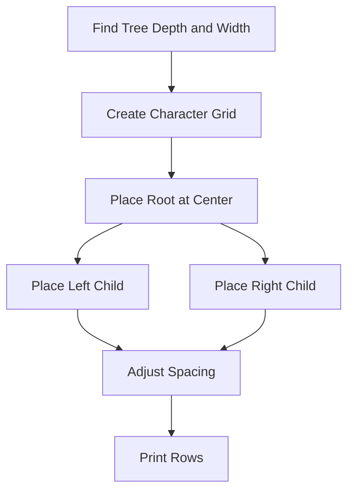
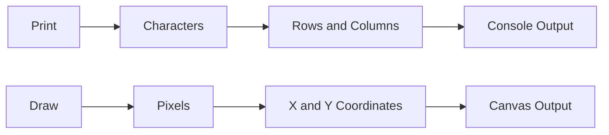
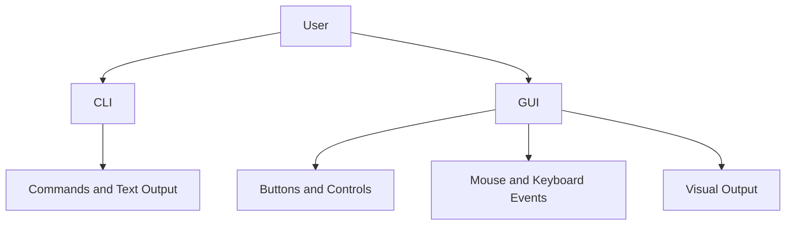
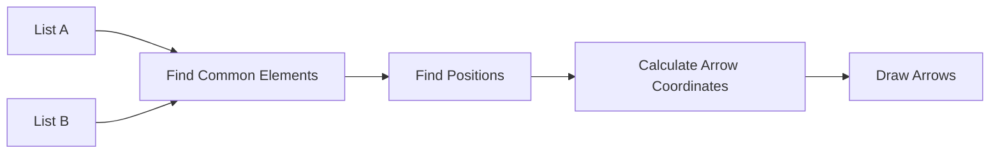
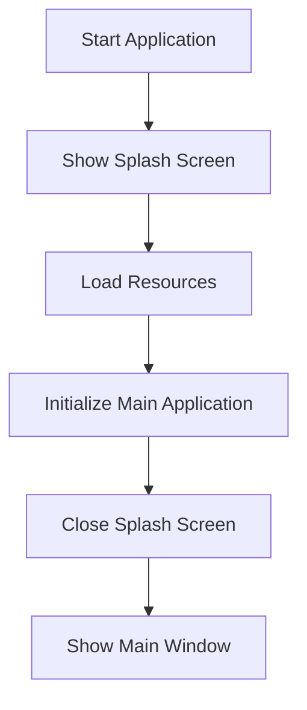
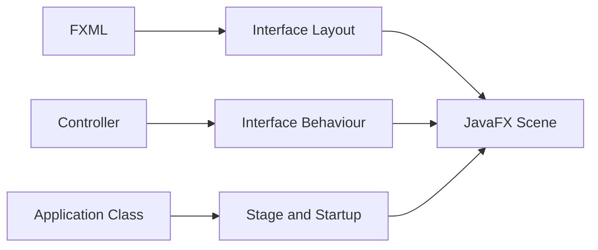

# Class Session: 03/09/26

## Notes

### 1. ASCII Tree Drawing

We worked on representing a tree using only text characters in the terminal. This is called an ASCII tree.

Unlike graphical drawing, where objects are placed using pixel coordinates, an ASCII tree uses rows, columns, spaces and characters such as `|`, `/` and `\` to show the structure.

For example:

```text
        10
       /  \
      5    15
     / \   / \
    3   7 12 20
```

The position of each node depends on its level in the tree. The spacing has to be adjusted at different levels so that the tree remains aligned.

One possible way to construct it is to first calculate the required width and then place the nodes and branch characters in a character grid.



This showed that layout problems can exist even when the output is only text.

### 2. Printing vs Drawing

We discussed the difference between printing output and drawing graphics.

Printing with:

```java
System.out.println();
```

works with characters in a text-based grid. The output is produced in sequence from left to right and then moves to the next line.

Drawing uses a coordinate system where objects can be placed at specific `(x, y)` positions. In Java, this can be done using `Graphics2D` in Swing or `GraphicsContext` in JavaFX.



Printing is useful for console output and ASCII art, while drawing gives more control over the position and appearance of graphical objects.

### 3. CLI and GUI

A CLI, or Command-Line Interface, is a text-based way of interacting with a program. The user enters commands and receives text output.

Java programs can use `System.in` for input and `System.out` for output in a CLI.

A GUI, or Graphical User Interface, uses visual components such as buttons, menus, text fields and canvases. The user can interact using the mouse and keyboard.

Java GUI frameworks include AWT, Swing and JavaFX.



The main difference is that CLI programs mainly work with text, while GUI programs provide visual interaction and feedback.

### 4. Drawing Arrows Between Common Elements of Two Lists

Another Java exercise involved taking two lists and finding the values that appear in both lists.

For every common element, the program finds its position in each list and draws an arrow connecting the two matching elements.

For example:

```text
List A          List B

3               8
7  ---------->  7
12 ----------- >12
5  ---------->  5
9               1
```

The program first processes the two lists and identifies the common elements. After that, the graphical part uses the positions of those elements to draw the arrows.

A `HashSet` can be used to find common values more efficiently than comparing every possible pair.



The arrow is drawn from the position of the matching element in the first list to its corresponding position in the second list.

This exercise connected data processing with graphical rendering.

### 5. Splash Screen

We also discussed splash screens in Java applications.

A splash screen is a temporary screen that appears when an application starts. It can show an application name, logo, version or loading information while the main application is being prepared.

A splash screen gives the user immediate visual feedback instead of leaving the impression that the program is not responding.

In JavaFX, a splash screen can be created using a separate `Stage`. FXML can be used to describe the layout and appearance of the interface.

The general process is:



The splash screen should not stay visible unnecessarily long, and long-running loading work should not block the JavaFX application thread.

### 6. FXML and Separation of Interface and Logic

FXML is an XML-based way of describing a JavaFX user interface. Instead of creating every control directly inside Java code, the structure of the interface can be written in an FXML file.

The controller is responsible for the behaviour of the interface, while the main application manages the JavaFX stages and startup.



This separation makes the application easier to organise because the interface design and program logic do not have to be kept in one large class.

## Questions

1. How is the spacing calculated when generating an ASCII tree so that the nodes remain aligned?

2. Why is it better to identify the common elements of the two lists before drawing the arrows?

3. Why should long-running work not block the JavaFX application thread?

## Reflection

Today's class showed me different ways in which information can be represented visually. The ASCII tree was interesting because it used only characters, but the program still had to calculate positions and spacing just like a graphical program would.

The difference between printing and drawing also became clearer. Printing is limited to a text grid, while drawing allows objects to be placed using actual coordinates. The comparison between CLI and GUI helped me understand why graphical programs need event handling for things such as mouse clicks and keyboard actions.

The two-list arrow exercise was useful because it connected data processing with graphics. The program first had to find the common elements and their positions before it could draw the correct connections.

The splash screen and FXML example showed another way of organising a graphical application. I understood that FXML can describe the interface while the controller handles its behaviour. These examples made me see that graphics programming is not only about drawing shapes, but also about how the data and interface are organised behind the final output.
