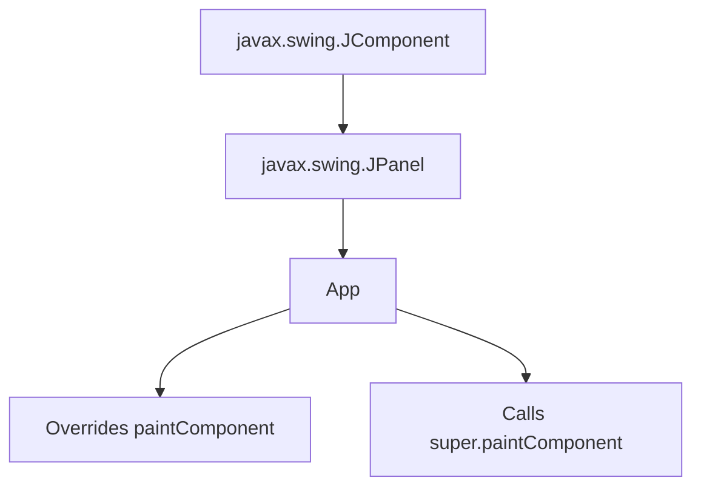
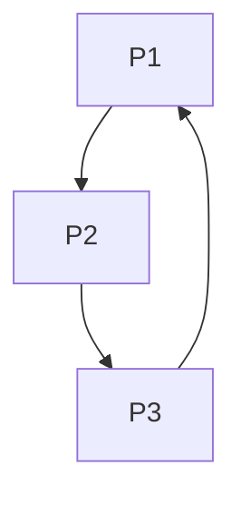
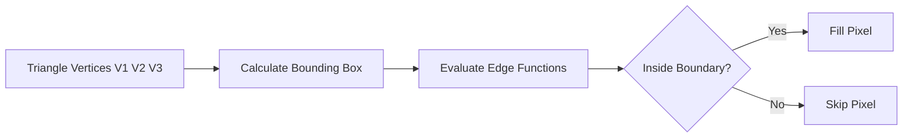

# Class Session: 20/08/26

## Notes

### Topic 1: GitHub Notes and Reflection Documentation

We discussed how to maintain the course repository in a consistent way. Each class session should have its own Markdown file containing the class notes and reflection together. The notes should explain the concepts covered in class, while the reflection records the main understanding from that session.

The files are maintained in the `Notes-and-Reflection` folder and are pushed to GitHub using the normal Git workflow.


### Topic 2: Java Classes, Subclasses, Inheritance and `@Override`

In Java, a class defines the structure and behaviour of objects. An object created from a class is called an instance.

Inheritance allows a subclass to reuse the properties and methods of a parent class. The `extends` keyword is used to create this relationship.

For example:

```java
public class App extends JPanel {
}
```

Here, `App` is a subclass of `JPanel`. This means that an object of `App` can be used where a `JPanel` is expected.

The `@Override` annotation is used when a subclass provides its own implementation of a method inherited from the parent class. It also helps the compiler check that the method correctly matches the parent method.

The `super` keyword refers to the immediate parent class. It can be used to call the original implementation of an overridden method.



### Topic 3: `paintComponent()` and Swing Rendering

In a Java Swing application, custom drawing is usually performed inside `paintComponent(Graphics g)`.

When the component needs to be painted or repainted, Swing calls this method. The overridden method first calls:

```java
super.paintComponent(g);
```

This allows the parent `JPanel` to perform its normal painting and clear the previous drawing before the subclass adds its own graphics.

After that, the drawing instructions can be written. For example, the graphics colour can be changed and a rectangle can be drawn or filled.

```mermaid
flowchart TD
    A[Swing repaint] --> B[paintComponent(Graphics g)]
    B --> C[super.paintComponent(g)]
    C --> D[Clear previous drawing]
    D --> E[g.setColor(...)]
    E --> F[g.fillRect(...) / g.drawRect(...)]
    F --> G[Shape appears]
```

Calling `super.paintComponent(g)` before drawing is important because otherwise old pixels or visual artifacts can remain when the component is repainted.

### Topic 4: Lines, Rectangles and Triangles

Computer graphics can create larger shapes from simple geometric primitives.

A line is defined using two points. A rectangle is defined using its position, width and height. A triangle can be represented using three vertices connected by three line segments.

For a rectangle:

```java
g2d.drawRect(200, 100, 200, 200);
```

the four values represent:

- `200` → x coordinate
- `100` → y coordinate
- `200` → width
- `200` → height

Since the width and height are equal, the rectangle forms a square.

A triangle is represented using three vertices:



The three connected edges form the boundary of the triangle.

### Topic 5: Boundary Method for Generating a Triangle

The boundary method can be used to determine which pixels belong inside a triangle.

First, the three triangle vertices are selected. The bounding box around the triangle is then calculated. For each pixel inside this bounding box, the edge functions of the three triangle edges are evaluated.

If the required edge-function conditions are satisfied for all three edges, the pixel lies inside or on the boundary of the triangle and can be filled.

The process can be represented as:



For a line between two points, the change in coordinates can be written as:

```text
Δx = x₂ - x₁
Δy = y₂ - y₁
```

The important idea is that a triangle can be reduced to three vertices and three boundary edges. This makes it possible to process the shape pixel by pixel.

### Topic 6: Connecting Java Code with Graphics

We also connected the Java concepts with the actual drawing program.

For example:

```java
Graphics2D g2d = (Graphics2D) g;
g2d.setColor(Color.BLUE);
g2d.setStroke(new BasicStroke(3));
g2d.drawRect(200, 100, 200, 200);
```

Here, the `Graphics` object is converted into `Graphics2D` to provide more control over rendering. The drawing colour and stroke width are then set before the square boundary is drawn.

This showed how Java class structure and inheritance are connected with the geometric concepts used to produce the final graphic.

## Questions

1. Why is `super.paintComponent(g)` required before adding custom drawing instructions?

2. How do the edge functions help in deciding whether a pixel belongs inside a triangle?

## Reflection

This class helped me understand that the graphical output is connected to both Java programming concepts and geometry. Earlier, I mainly looked at the shape that appeared on the screen, but now I can see that there is a proper process behind it.

The discussion on inheritance also made `extends`, `@Override` and `super` clearer to me. In the Swing program, I could understand why `paintComponent()` is overridden and why the parent method is called before drawing the shape.

The triangle boundary method was another useful part because it showed how a triangle can be treated as three vertices and three edges and then processed pixel by pixel. This made the connection between programming and actual computer graphics much clearer.