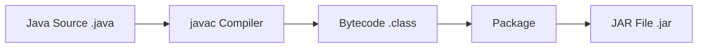
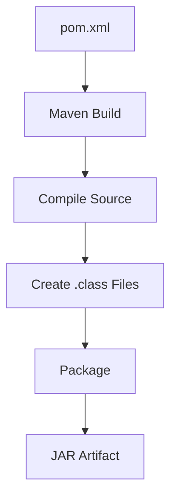
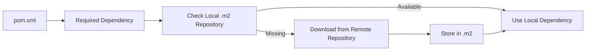
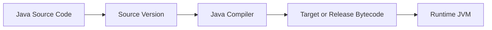

# Class Session: 27/08/26

## Notes

### 1. `.class` Files and `.jar` Files

Java source code written in a `.java` file is compiled using `javac` into bytecode stored in `.class` files. A `.class` file generally contains the compiled form of one Java class.

A JAR (Java Archive) file packages compiled classes, resources and other files into a single archive. It can be used to distribute a Java application or to provide a reusable library.

The basic process is:



Generated files such as `.class` files, JAR files and the Maven `target` directory are generally not kept in Git when they can be recreated from the source code and project configuration. This keeps the repository smaller and allows the project to be rebuilt when needed.

### 2. `pom.xml` and Maven Packaging

The `pom.xml` file is the main configuration file of a Maven project. It contains project information, dependencies, plugins and build settings.

Maven uses this information during the build lifecycle to compile the source code and package the resulting classes into a JAR when the project is configured for JAR packaging.



The advantage of using Maven is that the build process can be described through the project configuration instead of manually compiling classes and managing every library.

### 3. Maven Local Repository and `.m2`

Maven uses a local repository to store downloaded dependencies and project artifacts. This repository is normally found inside the `.m2` directory in the user's home directory.

When Maven needs a dependency, it checks the local repository first. If the required library is already present, Maven can reuse it. Otherwise, Maven downloads the dependency from a remote repository and stores it locally.



The `install` phase of Maven can also place the project's built artifact into the local repository so that another local project can use it as a dependency.

### 4. Java Packages and Dependency Management

A Java package is used to group related classes and interfaces and to organise the code into namespaces.

Maven dependencies are declared inside the `pom.xml` file. A dependency is normally identified using:

```text
groupId
artifactId
version
```

These values help Maven identify the required library and resolve the correct artifact.

Maven can also resolve transitive dependencies, meaning that when one library depends on another library, Maven can retrieve the required dependency automatically.

### 5. Continuous Integration and Continuous Delivery

We discussed release management and the idea of CI/CD.

**Continuous Integration (CI)** means that code changes are regularly integrated into a shared repository and automatically checked. A CI pipeline can fetch the code, install dependencies, compile the project and run tests.

**Continuous Delivery (CD)** extends this process by preparing validated software for release. Continuous Deployment can go one step further by automatically deploying successful builds.


The main purpose is to find problems earlier and reduce the amount of manual work involved in building and releasing software.

### 6. Character Encoding and UTF-8

Character encoding is the method used to represent characters as bytes.

We discussed UTF-8 and UTF-16. UTF-8 is widely used and is compatible with ASCII for common characters. It can also represent characters from many different writing systems.

In Maven, the source encoding can be specified explicitly in `pom.xml`:

```xml
<project.build.sourceEncoding>UTF-8</project.build.sourceEncoding>
```

Using an explicit encoding helps keep text handling consistent when a project is built on different operating systems.

### 7. Java Source Version, Target Version and Runtime Version

Java projects need to consider the version used when compiling the source code as well as the version of the JVM that will run the program.

The **source version** determines which Java language features are allowed in the source code.

The **target or release version** determines the Java version for which the compiled bytecode is produced.

The **runtime version** is the Java Virtual Machine that actually executes the program.



These versions need to be compatible. Bytecode produced for a newer Java version cannot normally be executed by an older JVM.

### 8. JUnit and Testing Levels

JUnit is a Java testing framework used mainly for automated unit testing.

Testing can be considered at different levels:

| Testing Level | Purpose |
|---|---|
| Unit Testing | Tests individual methods or components |
| Integration Testing | Checks whether different parts work together |
| Acceptance Testing | Checks whether the software meets requirements |

JUnit allows developers to test individual pieces of code and catch errors before changes are combined into larger builds.

Maven can run these tests as part of its build lifecycle.

### 9. Maven Dependency Scopes

Dependencies are declared in the `<dependencies>` section of `pom.xml`.

A dependency normally contains information such as:

```xml
<groupId>...</groupId>
<artifactId>...</artifactId>
<version>...</version>
```

Maven also provides dependency scopes that control where a dependency is available during the build. For example, a testing dependency such as JUnit can be given test scope so that it is used for testing without becoming part of the normal application dependencies.

This helps keep the project's dependency structure organised.

## Questions

1. What is the main difference between a `.class` file and a `.jar` file?

2. Why does Maven use the `.m2` local repository instead of downloading the same dependency every time?

3. Why do Java projects need compatible source, target and runtime versions?

## Reflection

Today's class helped me understand more clearly what happens to a Java project after the source code is written. I understood the difference between a `.class` file, which contains compiled bytecode, and a JAR file, which packages compiled classes and other resources together.

The `.m2` directory and Maven dependency system also became clearer to me. Instead of manually downloading and managing libraries, Maven can use the information in `pom.xml` and handle the dependencies for the project.

The discussion on CI/CD showed me how building and testing can be automated rather than being done completely by hand. I also understood why encoding and Java version settings matter when the same project has to work in different environments.

JUnit and the different levels of testing helped me see that testing is an important part of development, not something done only at the very end. Overall, this class gave me a better understanding of how Java projects are built, tested and maintained.
